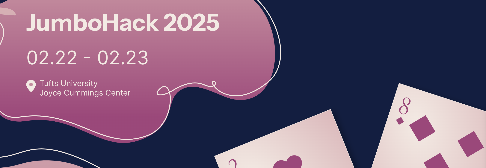
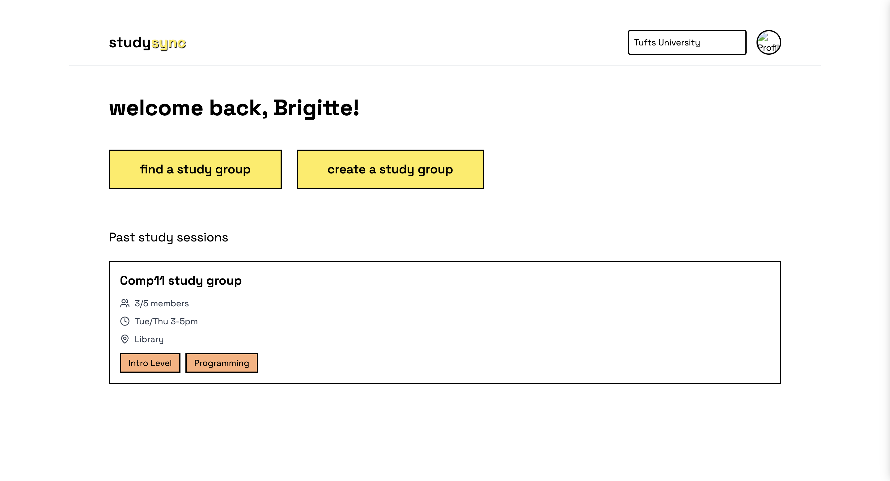
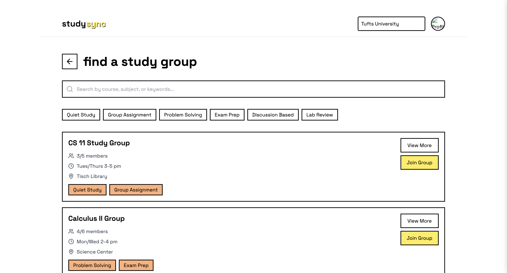
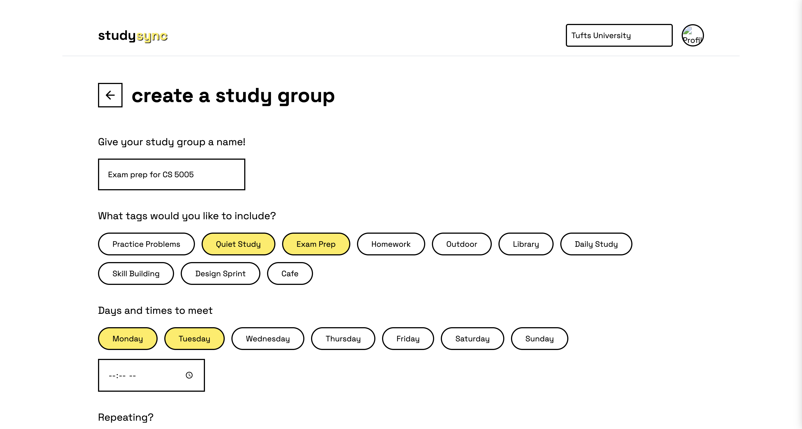

# My First Hackathon Experience at JumboHack 2025

After being intimidated with joining hackathons for years, I finally decided to participate in my first hackathon last weekend. I joined JumboHack 2025 at Tufts University. This was completely outside my comfort zone - I didn't know anyone and came in without any project idea. Here's how it went and what I learned along the way.

## Finding a Team

Team formation was surprisingly straightforward. The JumboHack team allotted some time in the schedule for team formation where participants can visit a room assigned to a particular track (Education, Emerging Tech, Sustainability, etc.) they might be interested in. I ended up choosing Education as this is what I'm most passionate about compared to other tracks. I found a group by simply approaching two participants and asking about their project. I communicated my goals: to learn and collaborate with others. Our team ended up with six members - three UX designers and three developers, all strangers just hours before. It was a good mix of graduate and undergraduate students. I was the only Northeastern student in the team.

## The Initial Project Idea - StudyBuddy? StudySync?

Our team wanted to work on was an app that would help university students join or form study groups within or or outside their classes - a digital solution to break down the isolation that many students experience in large university settings.

## The Collaborative Process

Our initial collaboration was promising:

- We fleshed out the project concept together
- I clarified technical questions as the designers built wireframes in Figma
- We brainstormed mechanisms for creating user groups
- I set up our dev environment with React, Tailwind CSS, and Node.js

The venue provided great perks - free food and even a complimentary one-month subscription to ChatGPT!

## When Reality Hit

By midday, our market research revealed a significant issue: potential users wouldn't actually use our app unless they didn't know anyone in their classes. For many, individual study sessions were sufficient.

This sparked internal debate. One teammate wanted to pivot completely, while others preferred enhancing our existing concept with additional features. We struggled to reach consensus, and by the end of Day 1, we still hadn't settled on a final direction. I was starting to get worried as we were losing time and hadn't started the development process.

## Technical Challenges

The technical side presented its own difficulties. My two fellow developers weren't as experienced with our chosen tech stack (JavaScript, React, Tailwind CSS), and I wasn't entirely confident in my own abilities either. Never did I imagine I'd become the lead developer at my first hackathon - it added significant pressure, but I realized I could leverage AI tools to learn and build quickly. Stepping far outside my comfort zone, I had to take charge to ensure our team would have something to submit. Dividing the workload became a delicate balancing act, and I unexpectedly found myself in a mentoring role - guiding teammates through unfamiliar concepts and troubleshooting their code, which substantially increased my responsibilities.

## The Breaking Point

Eventually, I felt overwhelmed, unsure if I could deliver by the deadline. I openly communicated these feelings to my teammates. My expectations for my first hackathon differed dramatically from reality. Collaborating with people of diverse backgrounds and skill levels, all of whom I'd just met that morning, proved far more demanding than anticipated.

I seriously considered going home early and even thought about quitting mid-hackathon. What kept me going was not wanting to let my team down. Since we only needed a website for the demo, I decided to persevere and focused on coding the frontend as soon as the wireframes were completed.

## Pulling Through

By morning, the lo-fi and hi-fi wireframes were ready thanks to all the amazing UX designers in the team. I leveraged Claude and ChatGPT to expedite the coding process. To simplify the demo, I hardcoded the information rather than implementing a backend.

After four intense hours, I successfully deployed the website using Vercel.

Here are some screenshots of the pages!

If you're interested in playing around with this, you may refer to the links below.

- **Link to Web App**: [https://study-sync-app-six.vercel.app/](https://study-sync-app-six.vercel.app/)
- **Source Code**: [https://github.com/asnts18/StudySync](https://github.com/asnts18/StudySync)

It's not fully functional yet given that everything is hard-coded for demo purposes. Which is why…

## Next Steps

… I will be continuing to work on the project as a way to improve my skills! There's so much features to add to this project - authentication, profile matching, integrated calendar sync, etc.

## Key Takeaways

This experience taught me valuable lessons for future hackathons:

1. **Come prepared with ideas**: Having a concept in mind gives you direction and purpose from the start.
2. **Practice beforehand**: Try out a (very) simple project using your preferred tech stack to build confidence. Even learning how to set up a new project will save tons of time.
3. **Embrace flexibility**: Don't cling to the first idea. Brainstorming is crucial - look for pain points you're passionate about solving.
4. **Value design thinking**: I gained immense respect for our UX designers, who crafted compelling problem statements, communicated product value, and created cohesive brand schemes. Their work made me want to learn Figma for wireframing and design.
5. **Set reasonable expectations**: Understand that teamwork with strangers will be challenging but rewarding in unexpected ways.
6. **Communicate openly**: When feeling overwhelmed, speak up rather than suffering silently. Your teammates will appreciate this.

For my next hackathon, I plan to arrive with a few project ideas, brush up on collaborative development workflows, and enter with a more realistic mindset about the challenges and rewards of rapid team development.

Despite the difficulties, this hackathon pushed me out of my comfort zone and taught me lessons that solo coding never could. Sometimes the most growth happens when things don't go according to plan.